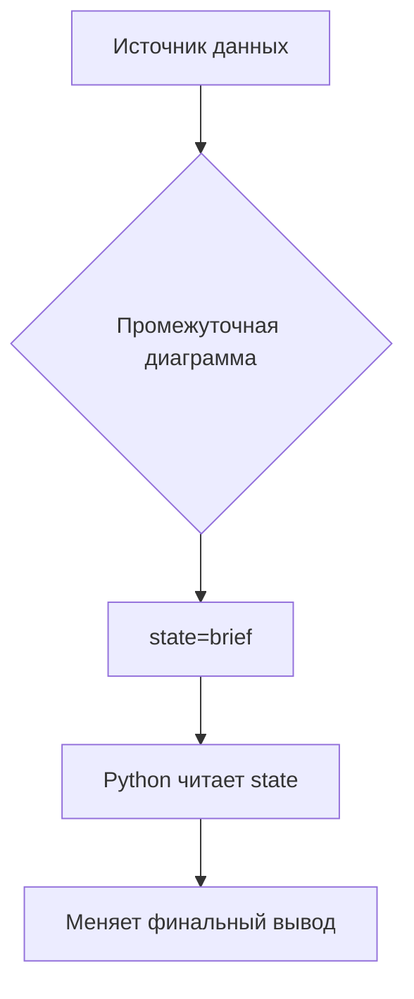

# Mermaid как промежуточный слой данных

Измени значение `state=...` в диаграмме (например, `brief`, `full`, `debug`) —
и запусти `python requirment.py`.

Поддерживаемые состояния:

- `brief` — краткий вывод
- `full` — подробный вывод
- `debug` — вывод с диагностикой
