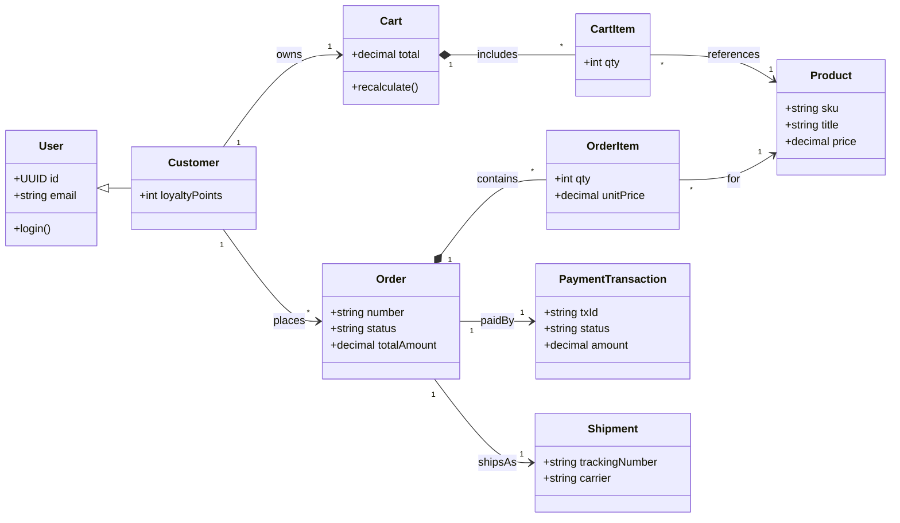

# Компактный пример диаграммы классов (Mermaid)

```mermaid
classDiagram
direction LR

class User {
  +UUID id
  +string email
  +login()
}

class Customer {
  +int loyaltyPoints
}

class Product {
  +string sku
  +string title
  +decimal price
}

class Cart {
  +decimal total
  +recalculate()
}

class CartItem {
  +int qty
}

class Order {
  +string number
  +string status
  +decimal totalAmount
}

class OrderItem {
  +int qty
  +decimal unitPrice
}

class PaymentTransaction {
  +string txId
  +string status
  +decimal amount
}

class Shipment {
  +string trackingNumber
  +string carrier
}

User <|-- Customer
Customer "1" --> "1" Cart : owns
Cart "1" *-- "*" CartItem : includes
CartItem "*" --> "1" Product : references
Customer "1" --> "*" Order : places
Order "1" *-- "*" OrderItem : contains
OrderItem "*" --> "1" Product : for
Order "1" --> "1" PaymentTransaction : paidBy
Order "1" --> "1" Shipment : shipsAs
```
