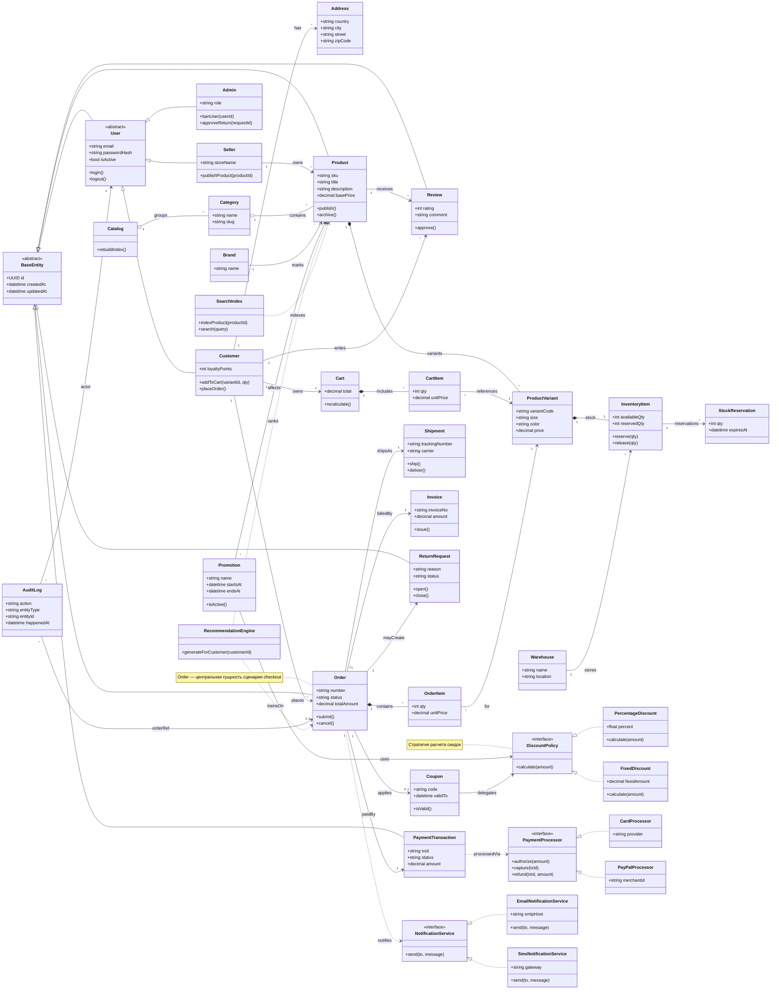

# Большой пример диаграммы классов (Mermaid)

```mermaid
classDiagram
direction LR

class BaseEntity {
  <<abstract>>
  +UUID id
  +datetime createdAt
  +datetime updatedAt
}

class User {
  <<abstract>>
  +string email
  +string passwordHash
  +bool isActive
  +login()
  +logout()
}

class Customer {
  +int loyaltyPoints
  +addToCart(variantId, qty)
  +placeOrder()
}

class Seller {
  +string storeName
  +publishProduct(productId)
}

class Admin {
  +string role
  +banUser(userId)
  +approveReturn(requestId)
}

class Address {
  +string country
  +string city
  +string street
  +string zipCode
}

class Catalog {
  +rebuildIndex()
}

class Category {
  +string name
  +string slug
}

class Brand {
  +string name
}

class Product {
  +string sku
  +string title
  +string description
  +decimal basePrice
  +publish()
  +archive()
}

class ProductVariant {
  +string variantCode
  +string size
  +string color
  +decimal price
}

class Review {
  +int rating
  +string comment
  +approve()
}

class InventoryItem {
  +int availableQty
  +int reservedQty
  +reserve(qty)
  +release(qty)
}

class Warehouse {
  +string name
  +string location
}

class StockReservation {
  +int qty
  +datetime expiresAt
}

class Cart {
  +decimal total
  +recalculate()
}

class CartItem {
  +int qty
  +decimal unitPrice
}

class Order {
  +string number
  +string status
  +decimal totalAmount
  +submit()
  +cancel()
}

class OrderItem {
  +int qty
  +decimal unitPrice
}

class Shipment {
  +string trackingNumber
  +string carrier
  +ship()
  +deliver()
}

class Invoice {
  +string invoiceNo
  +decimal amount
  +issue()
}

class ReturnRequest {
  +string reason
  +string status
  +open()
  +close()
}

class Coupon {
  +string code
  +datetime validTo
  +isValid()
}

class Promotion {
  +string name
  +datetime startsAt
  +datetime endsAt
  +isActive()
}

class DiscountPolicy {
  <<interface>>
  +calculate(amount)
}

class PercentageDiscount {
  +float percent
  +calculate(amount)
}

class FixedDiscount {
  +decimal fixedAmount
  +calculate(amount)
}

class PaymentProcessor {
  <<interface>>
  +authorize(amount)
  +capture(txId)
  +refund(txId, amount)
}

class CardProcessor {
  +string provider
}

class PayPalProcessor {
  +string merchantId
}

class PaymentTransaction {
  +string txId
  +string status
  +decimal amount
}

class NotificationService {
  <<interface>>
  +send(to, message)
}

class EmailNotificationService {
  +string smtpHost
  +send(to, message)
}

class SmsNotificationService {
  +string gateway
  +send(to, message)
}

class AuditLog {
  +string action
  +string entityType
  +string entityId
  +datetime happenedAt
}

class RecommendationEngine {
  +generateForCustomer(customerId)
}

class SearchIndex {
  +indexProduct(productId)
  +search(query)
}

BaseEntity <|-- User
BaseEntity <|-- Product
BaseEntity <|-- Order
BaseEntity <|-- Review
BaseEntity <|-- PaymentTransaction
BaseEntity <|-- ReturnRequest

User <|-- Customer
User <|-- Seller
User <|-- Admin

Customer "1" --> "*" Address : has
Seller "1" --> "*" Product : owns
Catalog "1" o-- "*" Category : groups
Category "1" o-- "*" Product : contains
Brand "1" --> "*" Product : marks

Product "1" *-- "*" ProductVariant : variants
Product "1" --> "*" Review : receives
Customer "1" --> "*" Review : writes

ProductVariant "1" *-- "1" InventoryItem : stock
Warehouse "1" --> "*" InventoryItem : stores
InventoryItem "1" --> "*" StockReservation : reservations

Customer "1" --> "1" Cart : owns
Cart "1" *-- "*" CartItem : includes
CartItem "*" --> "1" ProductVariant : references

Customer "1" --> "*" Order : places
Order "1" *-- "*" OrderItem : contains
OrderItem "*" --> "1" ProductVariant : for
Order "1" --> "0..1" Coupon : applies
Order "1" --> "1" Shipment : shipsAs
Order "1" --> "1" Invoice : billedBy
Order "1" --> "1" PaymentTransaction : paidBy
Order "1" --> "*" ReturnRequest : mayCreate

Promotion "*" --> "*" Product : affects
Promotion --> DiscountPolicy : uses
DiscountPolicy <|.. PercentageDiscount
DiscountPolicy <|.. FixedDiscount
Coupon --> DiscountPolicy : delegates

PaymentProcessor <|.. CardProcessor
PaymentProcessor <|.. PayPalProcessor
PaymentTransaction ..> PaymentProcessor : processedVia

NotificationService <|.. EmailNotificationService
NotificationService <|.. SmsNotificationService
Order ..> NotificationService : notifies

AuditLog "*" --> "1" User : actor
AuditLog "*" --> "0..1" Order : orderRef
RecommendationEngine ..> Order : trainsOn
RecommendationEngine ..> Product : ranks
SearchIndex ..> Product : indexes

note for Order "Order — центральная сущность сценария checkout"
note for DiscountPolicy "Стратегия расчета скидок"
```
