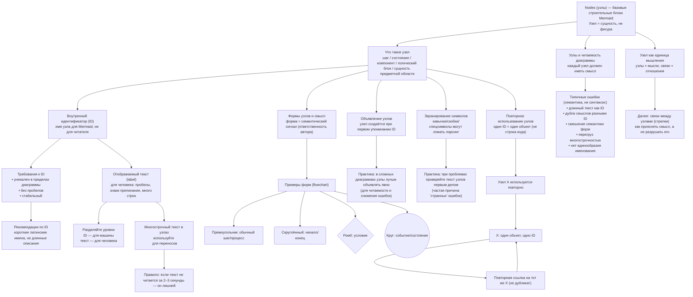

```mermaid
%% Тип диаграммы обязан быть первой строкой: дальше парсер применяет грамматику flowchart.
flowchart TD

%% Узел = сущность графа; форма — лишь визуализация.
N0["Nodes (узлы) — базовые строительные блоки Mermaid<br/>Узел = сущность, не фигура"]

%% Mermaid оперирует узлами как объектами: ID, текст, форма, (опционально) стиль/класс.
N0 --> N1["Что такое узел<br/>шаг / состояние / компонент / логический блок / сущность предметной области"]

%% Внутренний ID — ключ: по нему Mermaid связывает повторные упоминания в один объект.
N1 --> ID0["Внутренний идентификатор (ID)<br/>имя узла для Mermaid, не для читателя"]

%% Правила ID: уникальность, без пробелов, стабильность.
ID0 --> ID1["Требования к ID<br/>• уникален в пределах диаграммы<br/>• без пробелов<br/>• стабильный"]

%% Практика: короткие латинские ID в одном стиле.
ID1 --> ID2["Рекомендации по ID<br/>короткие латинские имена, не длинные описания"]

%% Отображаемый текст — то, что видит человек; может быть длинным/многострочным.
ID0 --> L0["Отображаемый текст (label)<br/>для человека: пробелы, знаки препинания, много строк"]

%% Разделение уровней: ID для машины, label для человека.
L0 --> L1["Разделяйте уровни<br/>ID — для машины<br/>текст — для человека"]

%% Формы узлов в flowchart задаются скобками/скобочными конструкциями вокруг label.
%% Круглые/квадратные/фигурные скобки — синтаксис формы, а не просто символы.
N1 --> SH0["Формы узлов и смысл<br/>форма = семантический сигнал (ответственность автора)"]

%% Переходим к примерам форм.
SH0 --> SH1["Примеры форм (flowchart)"]

%% Прямоугольник: ID["..."] или ID[...]
SH1 --> P1["Прямоугольник: обычный шаг/процесс"]

%% Скруглённый прямоугольник: ID("...")
SH1 --> P2("Скруглённый: начало/конец")

%% Ромб: ID{"..."}
SH1 --> P3{"Ромб: условие"}

%% Круг/состояние: ID((...))
SH1 --> P4(("Круг: событие/состояние"))

%% Синтаксис объявления: узел создаётся при первом упоминании его ID (в т.ч. в связи).
N1 --> DECL0["Объявление узлов<br/>узел создаётся при первом упоминании ID"]

%% Порядок строк влияет на читаемость, но не на факт существования узла после упоминания.
DECL0 --> DECL1["Практика: в сложных диаграммах узлы лучше объявлять явно<br/>(для читаемости и снижения ошибок)"]

%% Многострочный текст: переносы делаем через <br/>, чтобы не ломать парсер.
L0 --> ML0["Многострочный текст в узлах<br/>используйте <br/> для переносов"]

%% Риск визуального шума: слишком длинные label ухудшают восприятие.
ML0 --> ML1["Правило: если текст не читается за 2–3 секунды — он лишний"]

%% Экранирование: служебные символы в тексте узла иногда нужно экранировать.
N1 --> ESC0["Экранирование символов<br/>кавычки/скобки/спецсимволы могут ломать парсинг"]

%% Практика диагностики: при странных ошибках проверяем label (текст узлов).
ESC0 --> ESC1["Практика: при проблемах проверяйте текст узлов первым делом<br/>(частая причина 'странных' ошибок)"]

%% Повторное использование ID: один и тот же ID всегда указывает на один объект узла.
N1 --> RE0["Повторное использование узлов<br/>один ID = один объект (не строка кода)"]

%% Демонстрация: X встречается дважды — это один и тот же узел.
RE0 --> R1["Узел X используется повторно"]
R1 --> X["X: один объект, одно ID"]
X --> R2["Повторная ссылка на тот же X (не дубликат)"]
R2 --> X

%% Читаемость: цель не 'максимум узлов', а оправданность каждого узла.
N0 --> READ0["Узлы и читаемость диаграммы<br/>каждый узел должен иметь смысл"]

%% Типичные ошибки: Mermaid часто рендерит, но смысл диаграммы деградирует.
READ0 --> ERR0["Типичные ошибки (семантика, не синтаксис)<br/>• длинный текст как ID<br/>• дубли смыслов разными ID<br/>• смешение семантики форм<br/>• перегруз многострочностью<br/>• нет единообразия именования"]

%% Узел как единица мышления: сначала структура смысла, потом запись в Mermaid.
N0 --> THINK0["Узел как единица мышления<br/>узлы = мысли, связи = отношения"]

%% Завязка на следующий раздел курса (связи/стрелки).
THINK0 --> NEXT0["Далее: связи между узлами (стрелки)<br/>как прояснять смысл, а не разрушать его"]
```
