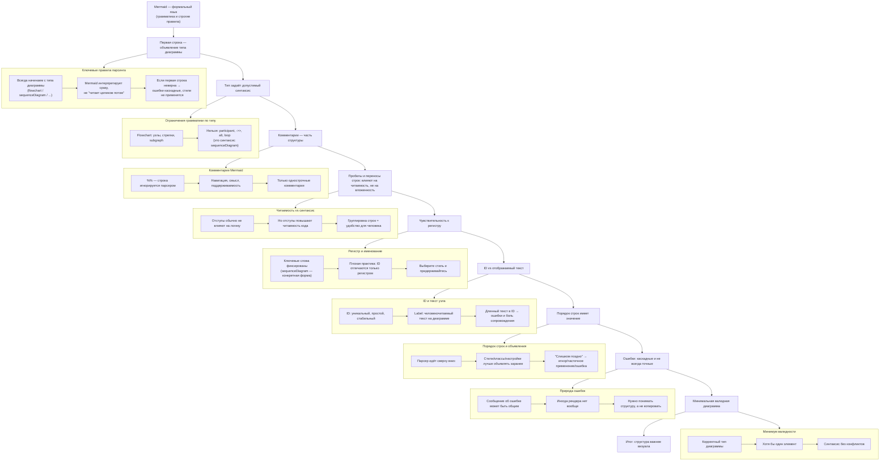

```mermaid
%% Первая строка задаёт грамматику: далее допустим только синтаксис flowchart.
flowchart TD

%% Важно: \n внутри label в flowchart может ломать парсинг в некоторых рендерах.
%% Для переноса строки используем <br/>, он трактуется как часть текста узла.
A["Mermaid — формальный язык<br/>(грамматика и строгие правила)"]

%% Связи не менялись: только текстовые метки узлов.
A --> B["Первая строка — объявление типа диаграммы"]
B --> C["Тип задаёт допустимый синтаксис"]
C --> D["Комментарии — часть структуры"]
D --> E["Пробелы и переносы строк: влияют на читаемость, не на вложенность"]
E --> F["Чувствительность к регистру"]
F --> G["ID vs отображаемый текст"]
G --> H["Порядок строк имеет значение"]
H --> I["Ошибки: каскадные и не всегда точные"]
I --> J["Минимальная валидная диаграмма"]
J --> K["Итог: структура важнее визуала"]

%% subgraph обязательно закрывать end — иначе парсер “потащит” блок дальше и сломает разбор.
subgraph S1[Ключевые правила парсинга]
  B1["Всегда начинаем с типа диаграммы<br/>(flowchart / sequenceDiagram / ...)"]
  B2["Mermaid интерпретирует сразу,<br/>не &quot;читает целиком потом&quot;"]
  B3["Если первая строка неверна →<br/>ошибки каскадные, стили не применятся"]
  B1 --> B2 --> B3
end

B --> S1

subgraph S2[Ограничения грамматики по типу]
  C1["Flowchart: узлы, стрелки, subgraph"]
  C2["Нельзя: participant, -&gt;&gt;, alt, loop<br/>(это синтаксис sequenceDiagram)"]
  C1 --> C2
end

C --> S2

subgraph S3[Комментарии Mermaid]
  D1["%% — строка игнорируется парсером"]
  D2["Навигация, смысл, поддерживаемость"]
  D3["Только однострочные комментарии"]
  D1 --> D2 --> D3
end

D --> S3

subgraph S4[Читаемость vs синтаксис]
  E1["Отступы обычно не влияют на логику"]
  E2["Но отступы повышают читаемость кода"]
  E3["Группировка строк = удобство для человека"]
  E1 --> E2 --> E3
end

E --> S4

subgraph S5[Регистр и именование]
  F1["Ключевые слова фиксированы<br/>(sequenceDiagram — конкретная форма)"]
  F2["Плохая практика: ID отличаются только регистром"]
  F3["Выберите стиль и придерживайтесь"]
  F1 --> F2 --> F3
end

F --> S5

subgraph S6[ID и текст узла]
  G1["ID: уникальный, простой, стабильный"]
  G2["Label: человекочитаемый текст на диаграмме"]
  G3["Длинный текст в ID → ошибки и боль сопровождения"]
  G1 --> G2 --> G3
end

G --> S6

subgraph S7[Порядок строк и объявления]
  H1["Парсер идёт сверху вниз"]
  H2["Стили/классы/настройки лучше объявлять заранее"]
  H3["&quot;Слишком поздно&quot; → игнор/частичное применение/ошибка"]
  H1 --> H2 --> H3
end

H --> S7

subgraph S8[Природа ошибок]
  I1["Сообщение об ошибке может быть общим"]
  I2["Иногда рендера нет вообще"]
  I3["Нужно понимать структуру, а не копировать"]
  I1 --> I2 --> I3
end

I --> S8

subgraph S9[Минимум валидности]
  J1["Корректный тип диаграммы"]
  J2["Хотя бы один элемент"]
  J3["Синтаксис без конфликтов"]
  J1 --> J2 --> J3
end

J --> S9

```
