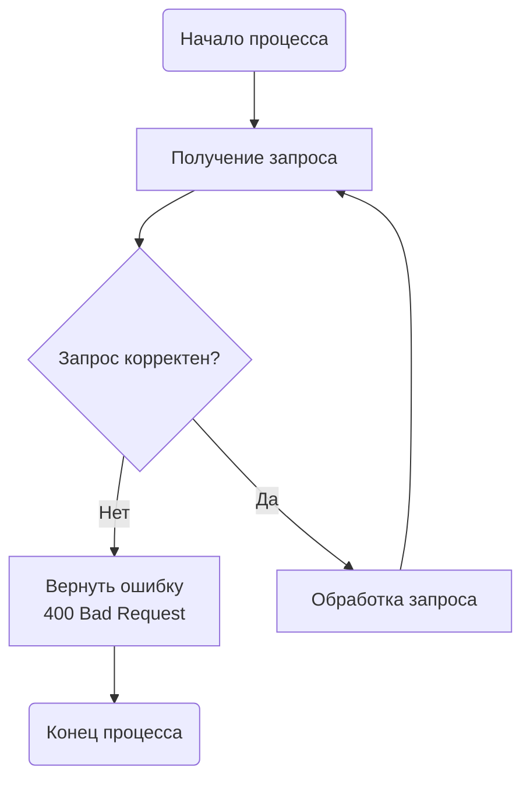

```mermaid
flowchart TD

start("Начало процесса")
recv["Получение запроса"]
validate{"Запрос корректен?"}

start --> recv --> validate

error["Вернуть ошибку<br/>400 Bad Request"]
finish("Конец процесса")
validate --> |Нет| error --> finish

process["Обработка запроса"]
validate --> |Да| process --> recv
```
