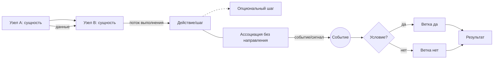

```mermaid
%% Диаграмма: связи (Edges) как операторы в Mermaid (flowchart)
%% Комментарии начинаются с %% и игнорируются Mermaid-парсером.

flowchart LR
  %% LR задаёт глобальное направление чтения слева направо; влияет на layout и "вектор" стрелок.

  A[Узел A: сущность] --> B[Узел B: сущность]
  %% --> это направленная сплошная связь (edge) от A к B.

  B -->|поток выполнения| C[Действие/шаг]
  %% Подпись связи задаётся через |...| и относится именно к ребру B-->C.

  C -.-> D[Опциональный шаг]
  %% -.-> пунктирная направленная связь (альтернативный/вторичный маршрут по принятой конвенции чтения).

  C --- E[Ассоциация без направления]
  %% --- создаёт ненаправленную связь (без наконечника). В flowchart это воспринимается как связь без явного потока.

  E -->|событие/сигнал| F((Событие))
  %% Узел F задан круглыми скобками (double parentheses) — это только форма узла, не тип связи.
  %% Смысл "событие" здесь передан подписью связи, а не синтаксисом стрелки.

  F --> G{Условие?}
  %% Узел G в фигурных скобках — ромб (decision). Это форма узла.

  G -->|да| H[Ветка да]
  G -->|нет| I[Ветка нет]
  %% Две разные направленные связи от одного узла. Mermaid допускает множественные исходящие ребра.

  H --> J[Результат]
  I --> J
  %% Две входящие связи в один узел J; Mermaid объединяет смысл на уровне графа, но визуально рисует две стрелки.

  %% Множественные связи между одними и теми же узлами (допустимо, но может ухудшать читаемость):
  A -->|данные| B
  %% Это второе ребро A->B с подписью. Mermaid отрисует отдельную связь (может идти параллельно первой).

  %% Стилизация ребра по индексу: linkStyle N ...
  %% Индексация linkStyle идёт по порядку объявления ребер (edge statements) сверху вниз, начиная с 0.
  linkStyle 2 stroke-dasharray: 5 5
  %% linkStyle 2 применится к третьему ребру (C -.-> D) и задаст пунктир (дополнительно к синтаксису).
```
