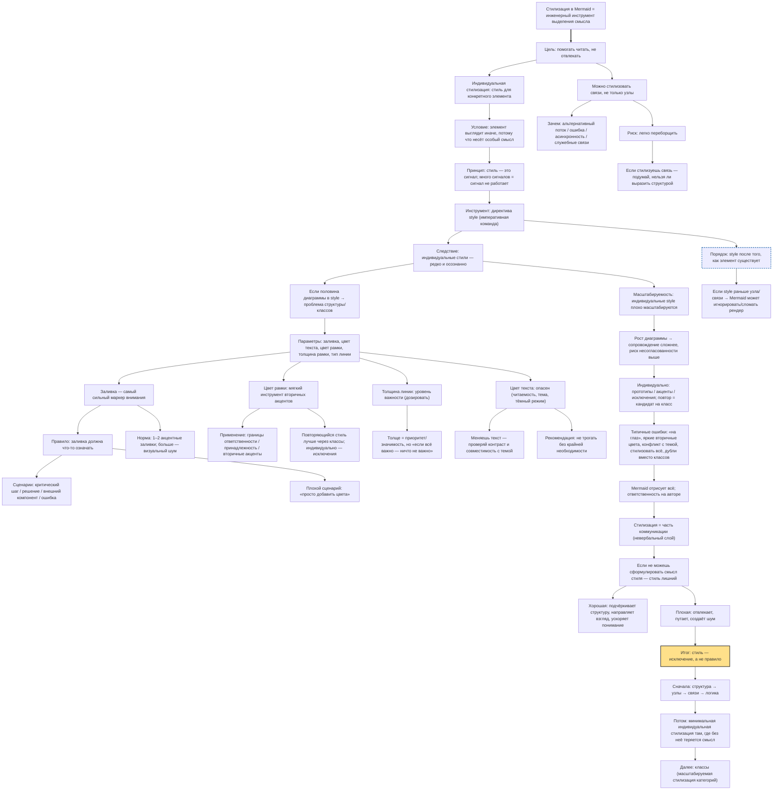

```mermaid
%% Диаграмма фиксирует логику из лекционного текста: стилизация = инженерный сигнал, а не украшение.
%% Комментарии ниже — только про то, как Mermaid-код работает и почему строки расположены именно так.

flowchart TD
  %% Узлы (идентификаторы слева) объявляются до применения style.
  A["Стилизация в Mermaid = инженерный инструмент выделения смысла"] --> B["Цель: помогать читать, не отвлекать"]

  B --> C["Индивидуальная стилизация: стиль для конкретного элемента"]
  C --> D["Условие: элемент выглядит иначе, потому что несёт особый смысл"]
  D --> E["Принцип: стиль — это сигнал; много сигналов = сигнал не работает"]

  E --> F["Инструмент: директива style (императивная команда)"]
  F --> G["Следствие: индивидуальные стили — редко и осознанно"]
  G --> H["Если половина диаграммы в style → проблема структуры/классов"]

  H --> I["Параметры: заливка, цвет текста, цвет рамки, толщина рамки, тип линии"]
  I --> J["Заливка — самый сильный маркер внимания"]
  J --> K["Правило: заливка должна что-то означать"]
  K --> L["Сценарии: критический шаг / решение / внешний компонент / ошибка"]
  K --> M["Плохой сценарий: «просто добавить цвета»"]
  J --> N["Норма: 1–2 акцентные заливки; больше — визуальный шум"]

  I --> O["Цвет рамки: мягкий инструмент вторичных акцентов"]
  O --> P["Применение: границы ответственности / принадлежность / вторичные акценты"]
  O --> Q["Повторяющийся стиль лучше через классы; индивидуально — исключения"]

  I --> R["Толщина линии: уровень важности (дозировать)"]
  R --> S["Толще = приоритет/значимость, но «если всё важно — ничто не важно»"]

  I --> T["Цвет текста: опасен (читаемость, тема, тёмный режим)"]
  T --> U["Меняешь текст — проверяй контраст и совместимость с темой"]
  T --> V["Рекомендация: не трогать без крайней необходимости"]

  B --> W["Можно стилизовать связи, не только узлы"]
  W --> X["Зачем: альтернативный поток / ошибка / асинхронность / служебные связи"]
  W --> Y["Риск: легко переборщить"]
  Y --> Z["Если стилизуешь связь — подумай, нельзя ли выразить структурой"]

  F --> AA["Порядок: style после того, как элемент существует"]
  AA --> AB["Если style раньше узла/связи → Mermaid может игнорировать/сломать рендер"]

  G --> AC["Масштабируемость: индивидуальные style плохо масштабируются"]
  AC --> AD["Рост диаграммы → сопровождение сложнее, риск несогласованности выше"]
  AD --> AE["Индивидуально: прототипы / акценты / исключения; повтор = кандидат на класс"]

  AE --> AF["Типичные ошибки: «на глаз», яркие вторичные цвета, конфликт с темой, стилизовать всё, дубли вместо классов"]
  AF --> AG["Mermaid отрисует всё; ответственность на авторе"]

  AG --> AH["Стилизация = часть коммуникации (невербальный слой)"]
  AH --> AI["Если не можешь сформулировать смысл стиля — стиль лишний"]
  AI --> AJ["Хорошая: подчёркивает структуру, направляет взгляд, ускоряет понимание"]
  AI --> AK["Плохая: отвлекает, путает, создаёт шум"]

  AK --> AL["Итог: стиль — исключение, а не правило"]
  AL --> AM["Сначала: структура → узлы → связи → логика"]
  AM --> AN["Потом: минимальная индивидуальная стилизация там, где без неё теряется смысл"]

  AN --> AO["Далее: классы (масштабируемая стилизация категорий)"]

  %% --- Индивидуальная стилизация (демонстрация именно механики style) ---
  %% style применяется к УЖЕ существующему узлу по его идентификатору.
  style AL fill:#FFE08A,stroke:#333,stroke-width:2px

  %% Мягкий акцент рамкой (без изменения цвета текста).
  style AA stroke:#2B6CB0,stroke-width:2px,stroke-dasharray: 5 3

  %% --- Стилизация связи (через linkStyle) ---
  %% linkStyle адресует связи по индексу (0 — самая первая стрелка в порядке объявления).
  %% В предыдущем варианте индекс был вне диапазона, из-за чего Mermaid получал undefined.
  %% Здесь выбран индекс 0, чтобы стиль гарантированно применился и диаграмма компилировалась.
  linkStyle 0 stroke:#333,stroke-width:3px
```
