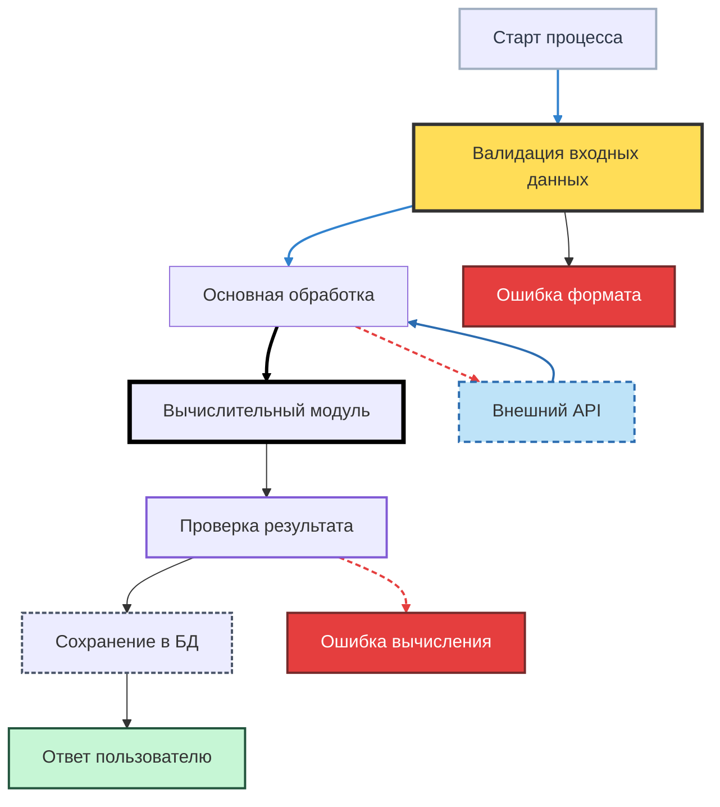

```mermaid
%% Демонстрация различных вариантов индивидуальной стилизации через style
%% Цель — показать синтаксис и диапазон параметров

flowchart TD

    A["Старт процесса"] --> B["Валидация входных данных"]
    B --> C["Основная обработка"]
    C --> D["Вычислительный модуль"]
    D --> E["Проверка результата"]
    E --> F["Сохранение в БД"]
    F --> G["Ответ пользователю"]

    %% Альтернативные и исключительные потоки
    B --> H["Ошибка формата"]
    E --> I["Ошибка вычисления"]
    C --> J["Внешний API"]
    J --> C

    %% --- Индивидуальная стилизация узлов ---

    %% 1. Яркая заливка + толстая рамка (критическая точка)
    style B fill:#FFDD57,stroke:#333,stroke-width:3px

    %% 2. Ошибка — красная заливка + белый текст
    style H fill:#E53E3E,color:#FFFFFF,stroke:#742A2A,stroke-width:2px
    style I fill:#E53E3E,color:#FFFFFF,stroke:#742A2A,stroke-width:2px

    %% 3. Внешний компонент — голубая заливка + пунктирная рамка
    style J fill:#BEE3F8,stroke:#2B6CB0,stroke-width:2px,stroke-dasharray: 6 4

    %% 4. Финальный узел — зелёная заливка
    style G fill:#C6F6D5,stroke:#22543D,stroke-width:2px

    %% 5. Узел с усиленной рамкой без изменения заливки
    style D stroke:#000000,stroke-width:4px

    %% 6. Узел с пунктирной рамкой
    style F stroke:#4A5568,stroke-width:2px,stroke-dasharray: 4 2

    %% 7. Узел с изменённым цветом текста (осторожный пример)
    style A color:#2D3748,stroke:#A0AEC0,stroke-width:2px

    %% 8. Нейтральный мягкий акцент через рамку
    style E stroke:#805AD5,stroke-width:2px

    %% --- Стилизация связей через linkStyle ---
    %% Индексация идёт по порядку объявления стрелок (начиная с 0)

    %% 0: A --> B
    linkStyle 0 stroke:#3182CE,stroke-width:2px

    %% 1: B --> C
    linkStyle 1 stroke:#3182CE,stroke-width:2px

    %% 2: C --> D
    linkStyle 2 stroke:#000000,stroke-width:3px

    %% 7: B --> H (альтернативная ветка ошибки)
    linkStyle 7 stroke:#E53E3E,stroke-width:2px,stroke-dasharray: 5 3

    %% 8: E --> I (ошибка вычисления)
    linkStyle 8 stroke:#E53E3E,stroke-width:2px,stroke-dasharray: 5 3

    %% 9: C --> J (внешний вызов)
    linkStyle 9 stroke:#2B6CB0,stroke-width:2px


```
