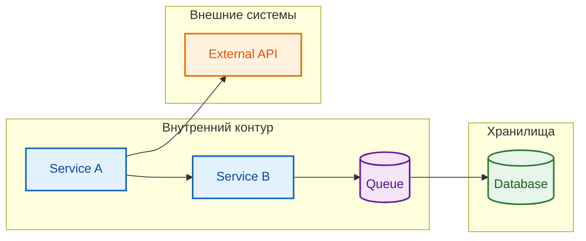

```mermaid
%% классы в Mermaid (classDef / class)
%% «системную» стилизацию через классы вместо точечных style.
%% код компилируемый, без лишних сущностей — только то, что нужно для запуска и демонстрации.

flowchart LR
  %% --- 1) Структура диаграммы (элементы сначала создаются) ---
  subgraph Core[Внутренний контур]
    S1[Service A]
    S2[Service B]
    Q[(Queue)]
  end

  subgraph Data[Хранилища]
    DB[(Database)]
  end

  subgraph Ext[Внешние системы]
    API[External API]
  end

  %% --- 2) Связи (логика взаимодействий) ---
  S1 --> S2
  S2 --> Q
  Q --> DB
  S1 --> API

  %% --- 3) Определения классов (classDef) ---
  %% classDef задаёт «норму» для целой категории узлов.
  %% Стили здесь — минимальный набор: заливка, рамка, текст, толщина рамки.
  classDef service  fill:#E3F2FD,stroke:#1565C0,stroke-width:2px,color:#0D47A1;
  classDef database fill:#E8F5E9,stroke:#2E7D32,stroke-width:2px,color:#1B5E20;
  classDef external fill:#FFF3E0,stroke:#EF6C00,stroke-width:2px,color:#E65100;
  classDef queue    fill:#F3E5F5,stroke:#6A1B9A,stroke-width:2px,color:#4A148C;
  classDef critical stroke:#B71C1C,stroke-width:4px;

  %% --- 4) Назначение классов (class) ---
  %% Правило порядка: элементы должны существовать ДО назначения класса.
  %% class не создаёт узел, а только применяет к нему визуальные правила.
  class S1,S2 service;
  class DB database;
  class API external;
  class Q queue;

  %% --- 5) Несколько классов на один элемент (редко и осознанно) ---
  %% Здесь API одновременно «external» (семантика) и «critical» (доп. признак важности).
  %% При конфликте стилей выигрывает последний объявленный classDef (по правилу Mermaid).
  class API external,critical;

```
