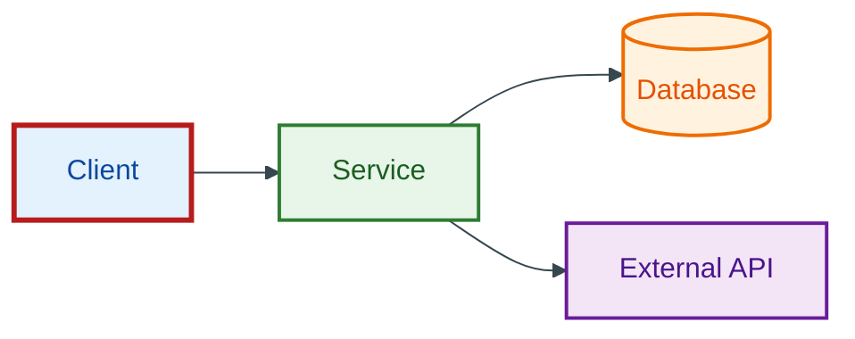

```mermaid
%% Тема: демонстрация глобальной темы и themeVariables
%% Цель: показать иерархию — Тема → Классы → Индивидуальный style
%% Код компилируемый, без избыточных сущностей.

%% --- 1) Глобальная инициализация темы ---
%% theme — выбор встроенной темы
%% themeVariables — тонкая настройка базовых параметров
%% Эти параметры применяются ко ВСЕЙ диаграмме.
%% Они задают «визуальную среду», но не знают семантики элементов.
%% Обратите внимание: это не CSS, набор переменных ограничен.

%%{init: {
  "theme": "base",
  "themeVariables": {
    "background": "#F9FAFB",
    "primaryColor": "#E3F2FD",
    "primaryBorderColor": "#1565C0",
    "primaryTextColor": "#0D47A1",
    "lineColor": "#37474F",
    "fontFamily": "Arial"
  }
}}%%

flowchart LR

  %% --- 2) Структура (смысл диаграммы) ---
  A[Client]
  B[Service]
  C[(Database)]
  D[External API]

  A --> B
  B --> C
  B --> D

  %% --- 3) Классы (переопределяют тему для категорий) ---
  %% Тема задала базовый primaryColor.
  %% Но классы уточняют стиль конкретных ролей.
  classDef service  fill:#E8F5E9,stroke:#2E7D32,stroke-width:2px,color:#1B5E20;
  classDef database fill:#FFF3E0,stroke:#EF6C00,stroke-width:2px,color:#E65100;
  classDef external fill:#F3E5F5,stroke:#6A1B9A,stroke-width:2px,color:#4A148C;

  class B service;
  class C database;
  class D external;

  %% --- 4) Индивидуальная стилизация (перекрывает всё выше) ---
  %% Это самый высокий уровень приоритета.
  %% Используется только для редких акцентов.
  style A stroke:#B71C1C,stroke-width:3px;

```
