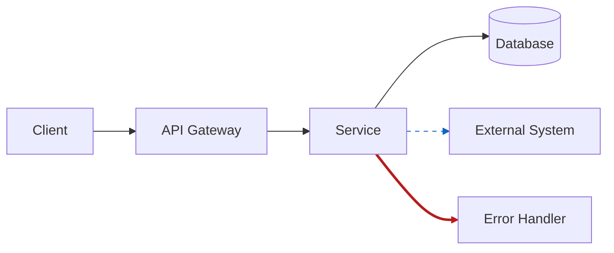

```mermaid
%% Стили связей (linkStyle)
%% аккуратная, минимальная стилизация связей.
%% связи нумеруются автоматически по порядку объявления, начиная с 0.

flowchart LR

  %% --- 1) Узлы (структура первична) ---
  A[Client]
  B[API Gateway]
  C[Service]
  D[(Database)]
  E[External System]
  F[Error Handler]

  %% --- 2) Связи (порядок критичен для linkStyle) ---
  %% Индексация будет следующей:
  %% 0: A --> B
  %% 1: B --> C
  %% 2: C --> D
  %% 3: C --> E
  %% 4: C --> F

  A --> B
  B --> C
  C --> D
  C --> E
  C --> F

  %% --- 3) Стили связей ---
  %% Основной поток (индексы 0,1,2) — оставляем стандартным.
  %% Альтернативный внешний вызов (индекс 3) — делаем пунктирным.
  %% Поток ошибки (индекс 4) — выделяем цветом и толщиной.

  %% Индекс 3: внешний вызов — пунктир как вторичный поток
  linkStyle 3 stroke:#1565C0,stroke-dasharray:5 5;

  %% Индекс 4: обработка ошибки — красный цвет и увеличенная толщина
  linkStyle 4 stroke:#B71C1C,stroke-width:3px;

```
