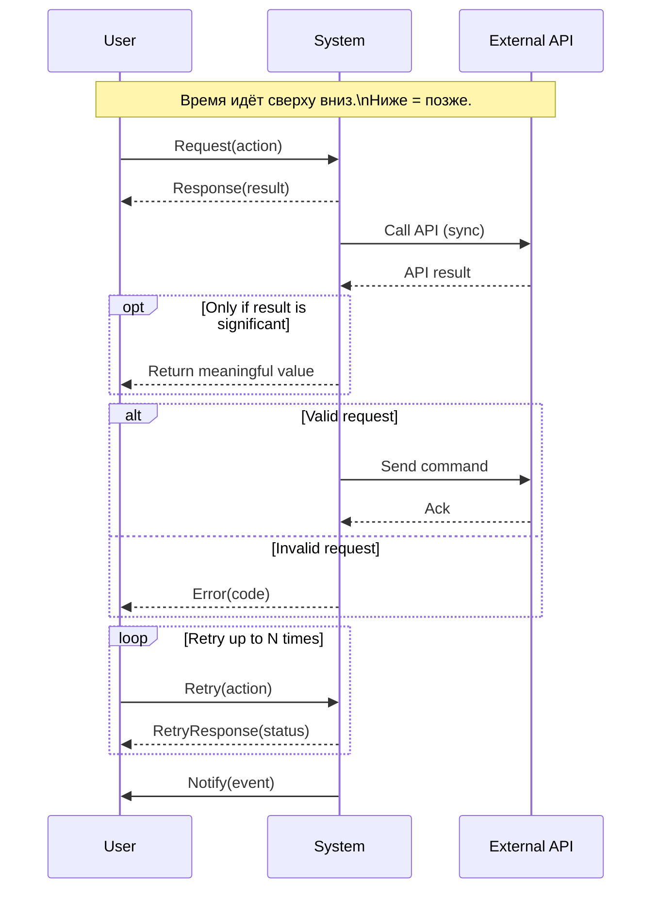

```mermaid
%% Mermaid Sequence Diagram: концептуальная модель (участники → сообщения → время)
%% Комментарии поясняют работу синтаксиса Mermaid и то, как он влияет на рендер/семантику.

sequenceDiagram
  %% sequenceDiagram — ключевое слово, переключающее парсер Mermaid в режим диаграммы последовательностей.

  %% participant задаёт «линию жизни» (lifeline). Порядок объявления = порядок слева направо.
  participant U as User
  participant S as System
  participant A as External API

  %% Note over/left of/right of — заметки. Они не заменяют сообщения и не влияют на порядок времени.
  Note over U,A: Время идёт сверху вниз.\nНиже = позже.

  %% Синхронный вызов: '->>' (по смыслу: отправитель ждёт и блокируется до ответа).
  U->>S: Request(action)

  %% Ответ (return) рисуется пунктиром: '-->>'. Это визуально «возврат управления/значения».
  S-->>U: Response(result)

  %% Асинхронное сообщение: '->>' тоже можно интерпретировать как sync, но для Mermaid\n
  %% именно '->>' и '-->>' различают «сообщение» и «ответ». Для явной асинхронности
  %% обычно используют '->>' + текст (event/notify) и отсутствие return.
  S->>A: Call API (sync)
  A-->>S: API result

  %% opt — опциональный блок. Компилятор рисует рамку, внутри — сообщения в порядке сверху вниз.
  opt Only if result is significant
    S-->>U: Return meaningful value
  end

  %% alt — альтернативы. Внутри обязательно минимум две ветки: 'else ...'.
  alt Valid request
    S->>A: Send command
    A-->>S: Ack
  else Invalid request
    S-->>U: Error(code)
  end

  %% loop — повторение. Внутри — повторяющийся фрагмент взаимодействия.
  loop Retry up to N times
    U->>S: Retry(action)
    S-->>U: RetryResponse(status)
  end

  %% Пример события без ответа: отправитель не ждёт return, поэтому обратная стрелка отсутствует.
  S->>U: Notify(event)
```
