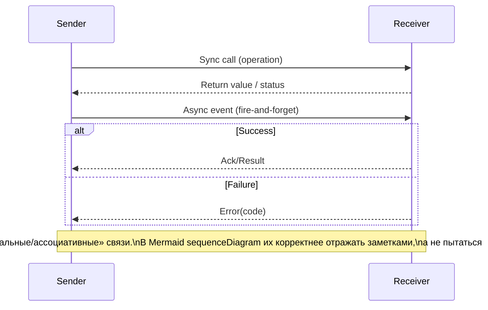

```mermaid
%% Mermaid Sequence Diagram: «словарь стрелок» и их семантика
%% Цель кода: показать, какие типы стрелок Mermaid понимает в sequenceDiagram,
%% и как они компилируются. Важно: не все UML-стрелки из вашего списка поддерживаются Mermaid 1:1.

sequenceDiagram
  participant A as Sender
  participant B as Receiver

  %% 1) СИНХРОННЫЙ вызов (call) — Mermaid: "->>"
  %% Семантика в диаграмме: A инициирует действие у B, ожидается завершение.
  A->>B: Sync call (operation)

  %% 2) ВОЗВРАТ/ответ — Mermaid: "-->>"
  %% Это не "новый вызов", а возврат результата по предыдущему sync call.
  B-->>A: Return value / status

  %% 3) АСИНХРОННОЕ сообщение (signal/event) — Mermaid: "->>"
  %% В Mermaid отдельная "open arrow async" как UML "->)" может быть недоступна/зависеть от версии,
  %% поэтому практический приём: обозначать async текстом + отсутствием return.
  A->>B: Async event (fire-and-forget)

  %% 4) ОТРИЦАТЕЛЬНЫЙ исход (альтернатива) — используем alt вместо "красивых" стрелок,
  %% потому что в sequence diagram ветвление — это конструкция управления временем/логикой.
  alt Success
    B-->>A: Ack/Result
  else Failure
    B-->>A: Error(code)
  end

  %% 5) СЛАБЫЕ/вспомогательные связи (пунктир без строгой семантики вызова)
  %% Mermaid в sequenceDiagram не использует "->" без наконечника как отдельный смысловой оператор,
  %% поэтому такие "слабые" связи лучше выражать Note.
  Note over A,B: В UML бывают «нейтральные/ассоциативные» связи.\nВ Mermaid sequenceDiagram их корректнее отражать заметками,\nа не пытаться подделать стрелками.

  %% 6) ЖЁСТКОЕ завершение «невозможность продолжения» — в Mermaid это обычно через destroy.
  %% Визуально это даёт крестик на lifeline, а не " -x " стрелку.
  destroy B
  %% После destroy любые сообщения к B будут логически некорректны (и часто выглядят странно).
```
