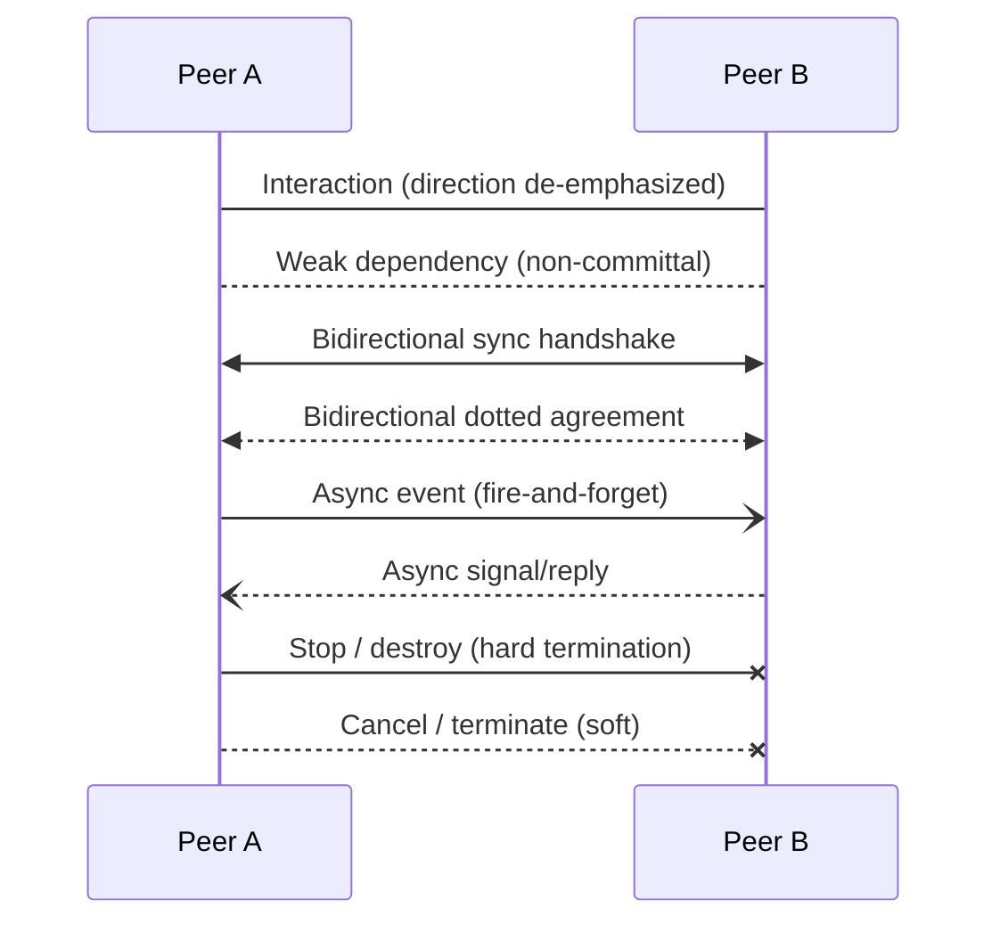

```mermaid
%% Здесь я показываю: ->, -->, <<->>, <<-->>, -x, --x, -), --)

sequenceDiagram
  participant A as Peer A
  participant B as Peer B

  %% 1) "->" — сплошная линия БЕЗ наконечника.
  %% Семантика: факт взаимодействия без акцента направления (редко уместно в строгом UML).
  A->B: Interaction (direction de-emphasized)

  %% 2) "-->" — пунктирная линия БЕЗ наконечника.
  %% Семантика: слабая/косвенная связь (dependency / association), не «вызов».
  A-->B: Weak dependency (non-committal)

  %% 3) "<<->>" — сплошная линия с ДВУНАПРАВЛЕННЫМИ наконечниками (Mermaid v11+).
  %% Семантика: симметричная синхронная операция (handshake как единый акт).
  A<<->>B: Bidirectional sync handshake

  %% 4) "<<-->>" — пунктирная линия с ДВУНАПРАВЛЕННЫМИ наконечниками (Mermaid v11+).
  %% Семантика: договорённость/синхронизация на high-level (слабее по «исполнению»).
  A<<-->>B: Bidirectional dotted agreement

  %% 5) "-)" — сплошная линия с ОТКРЫТЫМ наконечником (async).
  %% Семантика: асинхронное сообщение; отправитель не ждёт и не блокируется.
  A-)B: Async event (fire-and-forget)

  %% 6) "--)" — пунктирная линия с ОТКРЫТЫМ наконечником (async reply / async notification).
  %% Семантика: асинхронный ответ/сигнал без синхронного ожидания.
  B--)A: Async signal/reply

  %% 7) "-x" — сплошная линия с КРЕСТОМ в конце.
  %% Семантика: жёсткое завершение/stop/destroy сообщение (после него взаимодействие нельзя продолжать).
  A-xB: Stop / destroy (hard termination)

  %% 8) "--x" — пунктирная линия с КРЕСТОМ в конце.
  %% Семантика: мягче: логическое прекращение/отказ/отмена.
  A--xB: Cancel / terminate (soft)
```
