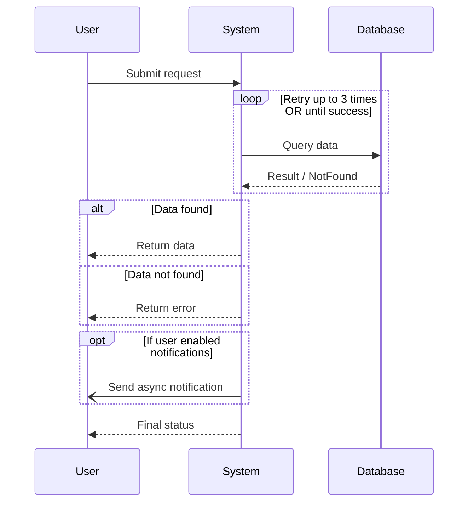

```mermaid
%% Mermaid Sequence Diagram: управляющие блоки loop, alt, opt
%% показать корректное и аналитически оправданное применение каждого блока.
%% блоки ограничивают область времени сверху вниз — всё внутри происходит
%% строго в том порядке, в каком записано.

sequenceDiagram
  participant U as User
  participant S as System
  participant DB as Database

  %% ЛИНЕЙНОЕ начало — без управляющих блоков
  %% Время идёт сверху вниз.
  U->>S: Submit request

  %% -------- LOOP --------
  %% loop обязательно содержит условие/контекст повторения.
  %% Всё внутри может выполняться многократно.
  loop Retry up to 3 times OR until success
    S->>DB: Query data
    DB-->>S: Result / NotFound
  end

  %% -------- ALT --------
  %% alt = взаимоисключающие ветки.
  %% Ровно ОДНА ветка будет выполнена.
  alt Data found
    S-->>U: Return data
  else Data not found
    S-->>U: Return error
  end

  %% -------- OPT --------
  %% opt = опциональный фрагмент.
  %% Может выполниться, а может быть полностью пропущен.
  opt If user enabled notifications
    S-)U: Send async notification
  end

  %% Завершение сценария (линейное продолжение времени)
  S-->>U: Final status
```
