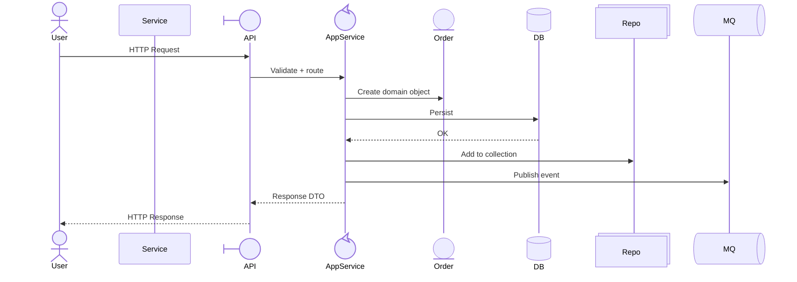

```mermaid
%% Mermaid Sequence Diagram: все поддерживаемые типы участников
%% Используется корректный синтаксис @{"type": "..."}.

sequenceDiagram

  %% ВАЖНО ДЛЯ КОМПИЛЯЦИИ:
  %% 1) В Mermaid JSON-объект в @{ ... } должен быть валидным JSON.
  %% 2) Самая частая ошибка — лишние пробелы/неправильные кавычки, из-за чего парсер ломается.
  %% 3) Формат правильный: participant Name@{"type":"boundary"} (без лишних ключей и с двойными кавычками).

  %% 1) ACTOR — внешний участник (иконка человечка)
  actor User

  %% 2) PARTICIPANT — обычный прямоугольник
  participant Service

  %% 3) BOUNDARY — граничный слой (UI/API)
  participant API@{"type":"boundary"}

  %% 4) CONTROL — управляющая логика
  participant AppService@{"type":"control"}

  %% 5) ENTITY — доменная сущность
  participant Order@{"type":"entity"}

  %% 6) DATABASE — хранилище данных
  participant DB@{"type":"database"}

  %% 7) COLLECTIONS — логическая коллекция
  participant Repo@{"type":"collections"}

  %% 8) QUEUE — очередь сообщений
  participant MQ@{"type":"queue"}

  %% Демонстрационные взаимодействия
  %% Синтаксис сообщения: Sender->>Receiver: Label
  %% Возврат (ответ) обычно показывают пунктиром: Receiver-->>Sender: Label

  User->>API: HTTP Request
  API->>AppService: Validate + route
  AppService->>Order: Create domain object
  AppService->>DB: Persist
  DB-->>AppService: OK
  AppService->>Repo: Add to collection
  AppService->>MQ: Publish event
  AppService-->>API: Response DTO
  API-->>User: HTTP Response
```
