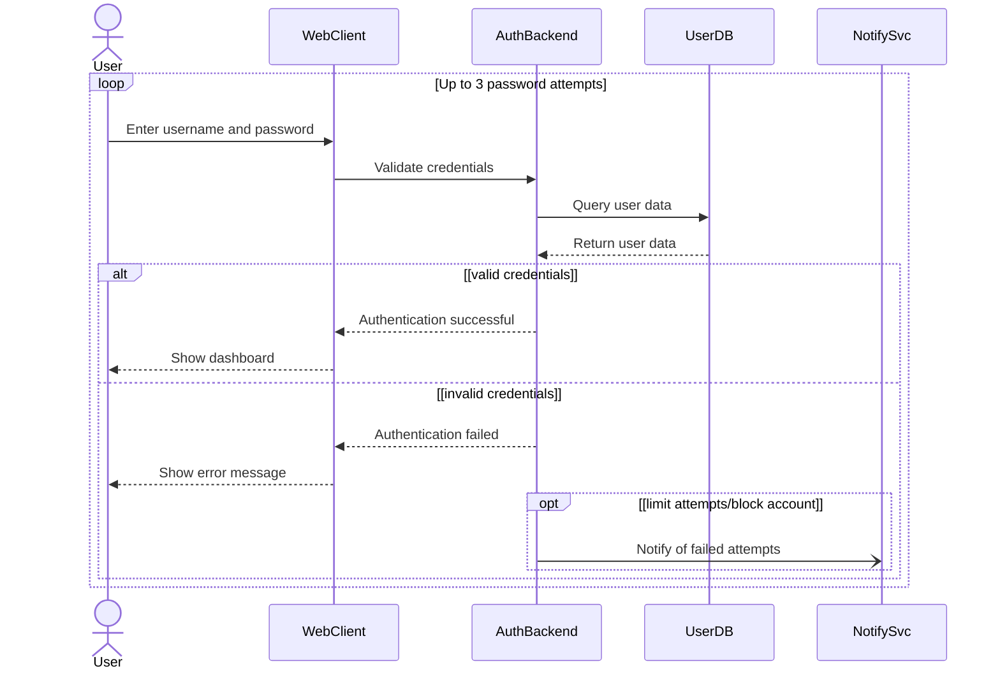

```mermaid
sequenceDiagram
    actor User
    participant WebClient
    participant AuthBackend
    participant UserDB
    participant NotifySvc

    loop Up to 3 password attempts
        User->>WebClient: Enter username and password
        WebClient->>AuthBackend: Validate credentials
        AuthBackend->>UserDB: Query user data
        UserDB-->>AuthBackend: Return user data

        alt [valid credentials]
            AuthBackend-->>WebClient: Authentication successful
            WebClient-->>User: Show dashboard

        else [invalid credentials]
            AuthBackend-->>WebClient: Authentication failed
            WebClient-->>User: Show error message
            opt [limit attempts/block account]
                AuthBackend-)NotifySvc: Notify of failed attempts
            end
        end
    end
```
