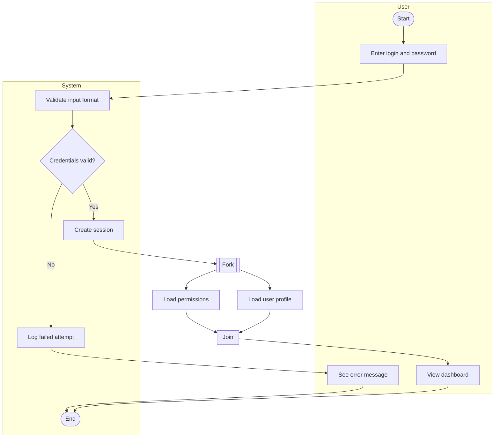

```mermaid
%% Activity Diagram (Mermaid)

flowchart TB

  %% --- Swimlanes через subgraph (зоны ответственности) ---
  subgraph User["User"]
    U1([Start])
    U2[Enter login and password]
    U3[View dashboard]
    U4[See error message]
  end

  subgraph System["System"]
    S1[Validate input format]
    S2{Credentials valid?}
    S3[Create session]
    S4[Log failed attempt]
    S5([End])
  end

  %% --- Основной поток ---
  U1 --> U2
  U2 --> S1
  S1 --> S2

  %% --- Ветвление (decision) ---
  %% Да/Нет — взаимоисключающие условия
  S2 -- Yes --> S3
  S2 -- No --> S4

  %% --- Параллельность после успешной авторизации ---
  %% Fork: создание сессии и загрузка данных могут идти параллельно
  S3 --> F1[[Fork]]
  F1 --> P1[Load user profile]
  F1 --> P2[Load permissions]

  %% Join: продолжаем только после завершения обоих потоков
  P1 --> J1[[Join]]
  P2 --> J1

  %% После join процесс возвращается к пользователю
  J1 --> U3
  U3 --> S5

  %% --- Альтернативный путь (ошибка) ---
  S4 --> U4
  U4 --> S5
```