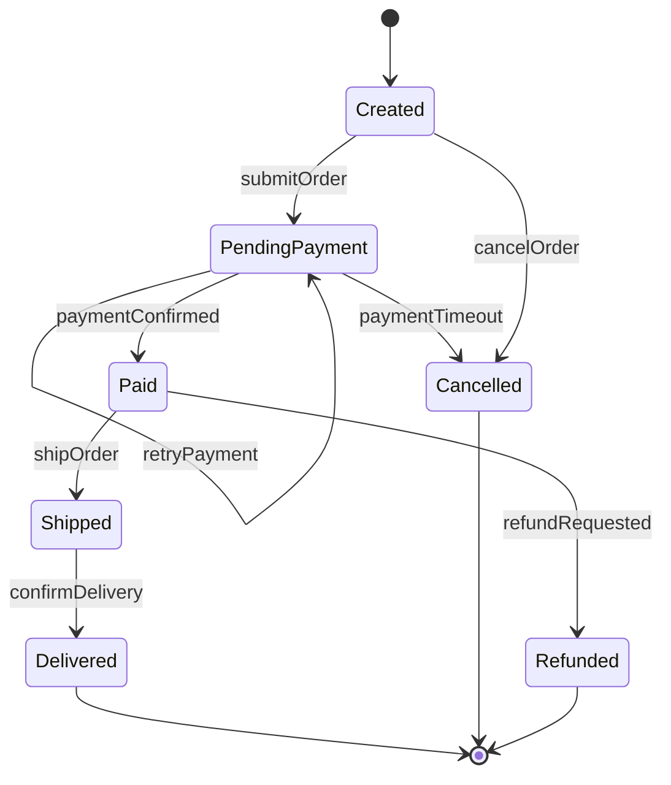

```mermaid
%% State Diagram (Mermaid)
%% Объект: Order (Заказ)
%% жизненный цикл одного объекта, корректные состояния, события перехода и конечное состояние.

stateDiagram-v2

    %% --- Начальное состояние ---
    %% Это точка входа в жизненный цикл.
    %% Не является полноценным состоянием.
    [*] --> Created

    %% --- Основные устойчивые состояния ---
    Created --> PendingPayment : submitOrder
    PendingPayment --> Paid : paymentConfirmed
    PendingPayment --> Cancelled : paymentTimeout

    %% --- Самопереход ---
    %% Объект остаётся в состоянии PendingPayment,
    %% но реагирует на событие повторной попытки оплаты.
    PendingPayment --> PendingPayment : retryPayment

    %% --- После оплаты ---
    Paid --> Shipped : shipOrder
    Shipped --> Delivered : confirmDelivery

    %% --- Альтернативное завершение ---
    Created --> Cancelled : cancelOrder
    Paid --> Refunded : refundRequested

    %% --- Конечные состояния ---
    Delivered --> [*]
    Cancelled --> [*]
    Refunded --> [*]
```