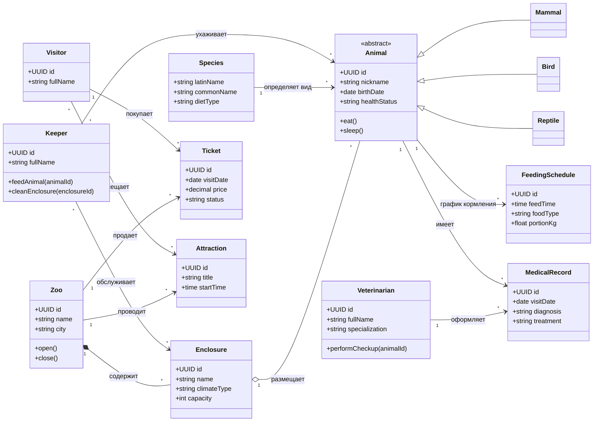

# Диаграмма классов: предметная область зоопарка

```mermaid
classDiagram
direction LR

class Zoo {
  +UUID id
  +string name
  +string city
  +open()
  +close()
}

class Enclosure {
  +UUID id
  +string name
  +string climateType
  +int capacity
}

class Animal {
  <<abstract>>
  +UUID id
  +string nickname
  +date birthDate
  +string healthStatus
  +eat()
  +sleep()
}

class Mammal
class Bird
class Reptile

class Species {
  +string latinName
  +string commonName
  +string dietType
}

class FeedingSchedule {
  +UUID id
  +time feedTime
  +string foodType
  +float portionKg
}

class Veterinarian {
  +UUID id
  +string fullName
  +string specialization
  +performCheckup(animalId)
}

class MedicalRecord {
  +UUID id
  +date visitDate
  +string diagnosis
  +string treatment
}

class Keeper {
  +UUID id
  +string fullName
  +feedAnimal(animalId)
  +cleanEnclosure(enclosureId)
}

class Visitor {
  +UUID id
  +string fullName
}

class Ticket {
  +UUID id
  +date visitDate
  +decimal price
  +string status
}

class Attraction {
  +UUID id
  +string title
  +time startTime
}

Animal <|-- Mammal
Animal <|-- Bird
Animal <|-- Reptile

Zoo "1" *-- "*" Enclosure : содержит
Enclosure "1" o-- "*" Animal : размещает
Species "1" --> "*" Animal : определяет вид

Animal "1" --> "*" FeedingSchedule : график кормления
Veterinarian "1" --> "*" MedicalRecord : оформляет
Animal "1" --> "*" MedicalRecord : имеет
Keeper "*" --> "*" Enclosure : обслуживает
Keeper "*" --> "*" Animal : ухаживает

Zoo "1" --> "*" Attraction : проводит
Zoo "1" --> "*" Ticket : продает
Visitor "1" --> "*" Ticket : покупает
Visitor "*" --> "*" Attraction : посещает
```
